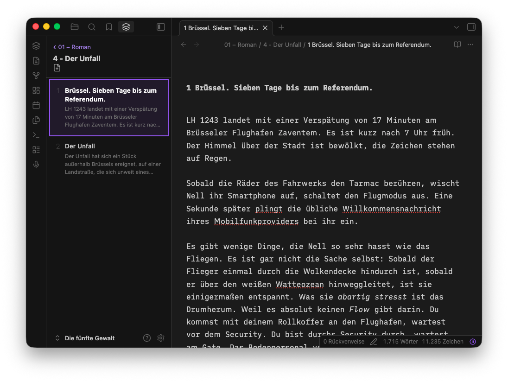

# Sheet Navigator

A single-column, drill-down sidebar for [Obsidian](https://obsidian.md) — built for writers who organize novels, screenplays, and long-form projects in folders and numbered files.

Browse your vault one level at a time: chapters show as cards with note counts, scenes show content previews. Click a scene to open it.



## Features

- **Drill-down navigation** — single-column view, one level at a time
- **Content previews** — each note card shows the first few lines of text
- **Smart name parsing** — extracts chapter numbers and titles from filenames like `1 – Die Preisverleihung` or `3 - Chapter Three`
- **Drag-and-drop reordering** — reorder scenes and chapters by dragging; items are renumbered sequentially (opt-in via settings)
- **New note button** — creates the next numbered note in the current folder (`Cmd+N`)
- **Right-click context menu** — rename or delete files and folders
- **Active note highlight** — the currently open note is highlighted in the sidebar
- **Live updates** — the list refreshes when files are created, renamed, or modified
- **Editorial review** — suggest edits and leave comments in CriticMarkup, then accept or reject them one at a time from a side drawer

## How it works

Open the navigator from the **ribbon icon** (layers) or the command palette ("Open Sheet Navigator").

The navigator shows the contents of the current folder. Folders appear as chapter cards with note counts and a drill-in chevron. Notes appear as cards with a title and content preview.

### Filename-based ordering

Numbered items come first in numeric order, then everything else alphabetically. Use numeric prefixes to control order:

```
1 – Prolog.md
2 – Die Nachricht.md
3.md
99 – Notes.md
```

### Drag-and-drop reordering

Enable **Settings > Sheet Navigator > Enable ordering** to show drag handles. Dragging and dropping renumbers the folder sequentially (1, 2, 3…), preserving each item's title and its choice of separator.

Items **without** a number are left alone — they keep their exact filename and sort to the end of the list. Dragging an unnumbered item into the numbered run is the one action that gives it a number.

Folders and notes are numbered as separate sequences, so dragging a note onto a chapter folder is refused rather than producing two items that share a number.

## Editorial review

An editorial pass on a chapter is a round trip: the text gets marked up, then you walk the marks and decide. Sheet Navigator stores those marks as [CriticMarkup](http://criticmarkup.com) — plain text in the note itself, no sidecar database — and shows them in a **Review** drawer for the sheet you have open.

The workflow this is built for: ask Claude (or any assistant) to *"review chapter 3 and mark it up in CriticMarkup"*, then open the drawer and work through what comes back.

### The five marks

| Written | Means | Accept | Reject |
|---|---|---|---|
| `{++neuer Text++}` | insertion | keeps it | drops it |
| `{--alter Text--}` | deletion | removes it | keeps it |
| `{~~alt~>neu~~}` | substitution | writes `neu` | keeps `alt` |
| `{==Text==}` | highlight | — resolve unwraps it | |
| `{>>Kommentar<<}` | comment | — resolve deletes it | |

A `{>>comment<<}` written directly after another mark belongs to it and shares its card.

Obsidian's own syntax is read too: `%%Kommentar%%` is a standalone comment, and `==Text==%%Kommentar%%` is a commented highlight. A plain `==Text==` on its own is left alone — that's ordinary markdown, not an editorial mark.

### Working through a pass

Open the drawer from the **Review button** in the navigator toolbar, or the command palette. Each mark becomes a card showing the affected text as the change itself: struck through for a deletion, underlined for an insertion. Click a card to jump to it in the editor.

- **Accept / Reject** decide a suggestion
- **Resolve** clears a highlight or comment, leaving the text
- **⋯ → Accept all / Reject all** clears the whole note at once

Every action is written through the editor, so **⌘Z undoes it** like any other edit.

### Marking up by hand

Every construct has a command, so the whole format is reachable from the command palette (`⌘P`). Typing *suggest* brings up the three suggestion types together; typing *markup* brings up the whole-note actions.

| Command | Needs a selection | Writes |
|---|---|---|
| Comment on selection — `⌘⇧M` | yes | `{==Text==}{>>…<<}`, caret in the comment |
| Highlight selection | yes | `{==Text==}` |
| Suggest deletion | yes | `{--Text--}` |
| Suggest insertion… | no | `{++Text++}` — wraps a selection, or asks what to insert |
| Suggest replacement… | yes | `{~~alt~>neu~~}` — asks for the new wording |
| Accept all markup in this note | no | resolves everything, keeping the suggestions |
| Reject all markup in this note | no | resolves everything, turning them all down |
| Open review panel | no | — |

The four wrapping commands are also on the editor's right-click menu. Nothing in your note is ever modified unless you invoke one of these.

### Known limitations

- A mark may wrap across a soft line break but not across a blank line, so there are no multi-paragraph anchors. This also stops a stray `{++` from swallowing the rest of the note when it eventually meets a `++}`.
- Marks do not nest. `{==a {==b==} c==}` closes at the first `==}`.
- **Accept all** / **Reject all** rewrite everything between the first and last mark in one edit, so the cursor can move if it was sitting between them. Deciding marks one at a time leaves the cursor exactly where it was.
- `{--alt--}{++neu++}` is read as two separate marks, not as one substitution. Use `{~~alt~>neu~~}` for that.
- Whitespace left behind by a resolved mark is yours to tidy; the plugin does not guess.
- In Reading view, only CriticMarkup renders. Obsidian removes `%%comments%%` from the page before any plugin can see them, so those stay invisible there — exactly as they are without this plugin.

## Installation

### From Obsidian Community Plugins

1. Open **Settings > Community plugins > Browse**
2. Search for "Sheet Navigator"
3. Click **Install**, then **Enable**

### Manual

1. Download `main.js`, `styles.css`, and `manifest.json` from the [latest release](../../releases/latest)
2. Create a folder `sheet-navigator` in your vault's `.obsidian/plugins/` directory
3. Copy the three files into it
4. Enable the plugin in **Settings > Community plugins**

## Development

```bash
npm install
npm run dev    # watch mode
npm run build  # production build
npm test       # run tests
```

## License

Apache 2.0
